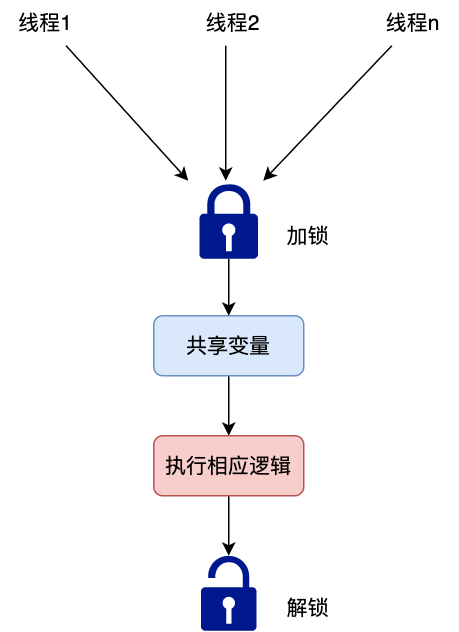
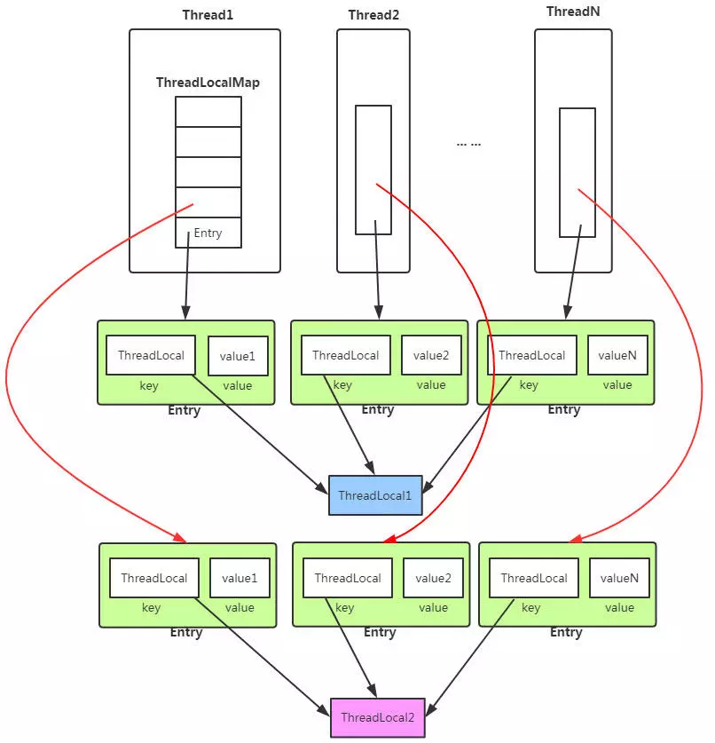

不同客户端请求的客户端信息（wifi 还是 4G，机型，app名称，电量等）显然不一样，
dubbo 业务线程拿到客户端请求后首先会将有用的请求信息提取出来（如本文中的 Map clientInfo），
但这个 clientInfo 可能会在线程调用的各个方法中用到，
于是如何存储就成为了一个现实的问题，相信有经验的朋友一下就想到了，
没错，用 Threadlocal ！为什么用它，它有什么优势，简单来说有两点

无锁化提升并发性能
简化变量的传递逻辑

1.无锁化提升并发性能
先说第一个，无锁化提升并发性能，影响并发的原因有很多，其中一个很重要的原因就是锁，为了防止对共享变量的竞用，不得不对共享变量加锁
!
如果对共享变量争用的线程数增多，显然会严重影响系统的并发度，最好的办法就是使用“影分身术”为每个线程都创建一个线程本地变量，这样就避免了对共享变量的竞用，也就实现了无锁化
[img_1.png](img_1.png)

ThreadLocal 即线程本地变量，它可以为每个线程创建一份线程本地变量，使用方法如下

```java
static ThreadLocal<SimpleDateFormat> threadLocal1 = new ThreadLocal<SimpleDateFormat>() {
@Override
protected SimpleDateFormat initialValue() {
    return new SimpleDateFormat("yyyy-MM-dd");
    }
};

public String formatDate(Date date) {
    return threadLocal1.get().format(date);
}
```
这样的话每个线程就独享一份与其他线程无关的 SimpleDateFormat 实例副本，
它们调用 formatDate 时使用的 SimpleDateFormat 实例也是自己独有的副本，无论对副本怎么操作对其他线程都互不影响

通过以上例子我们可以看出，
可以通过 new ThreadLocal+ initialValue 来为创建的 ThreadLocal 实例初始化本地变量（initialValue 方法会在首次调用 get 时被调用以初始化本地变量）。
当然，如果之后需要修改本地变量的话，也可以用以下方式来修改

可能一些朋友会好奇线程本地变量是如何存储的，一图胜千言

每一个线程（Thread）内部都有一个 ThreadLocalMap, ThreadLocal 的 get 和 set 操作其实在底层都是针对 ThreadLocalMap 进行操作的
它与 HashMap 类似，存储的都是键值对，只不过每一项（Entry）中的 key 为 threadlocal 变量（如上文案例中的 threadLocal1），
value 才为我们要存储的值（如上文中的 SimpleDateFormat 实例）,此外它们在碰到 hash 冲突时的处理策略也不同，
HashMap 在碰到 hash 冲突时采用的是链表法，而 ThreadLocalMap 采用的是线性探测法

散列就是哈希 散列函数的初衷是避免数据扎堆，所以后面必须改进。

优点：
    无需附加空间（指针、链表、溢出区）
    探测序列具有局部性，可以利用系统缓存，减少IO
缺点：
    耗费时间>O(1)
    冲突增多——以往的冲突会导致后续的连环冲突，发生惨烈的车祸

2.简化变量的传递逻辑
接下来我们来看使用 ThreadLocal 的等二个好处，简化变量的传递逻辑，线程在处理业务逻辑时可能会调用几十个方法，如果这些方法中只有几个需要用到 clientInfo，难道要在这几十个方法中定义一个 clientInfo 参数来层层传递吗，显然不现实。那该怎么办呢，使用 ThreadLocal 即可解决此问题。由上文可知通过 ThreadLocal 设置的本地变量是同 threadlocal 一起保存在 Thread 的 ThreadLocalMap 这个内部类中的，所以可在线程调用的任意方法中取出，伪代码如下
```java
public class ThreadLocalWithUserContext implements Runnable {

    private static ThreadLocal<Map<String,String>> threadLocal 
      = new ThreadLocal<>();

    @Override
    public void run() {
                // clientInfo 初始化
        Map<String, String> clientInfo = xxx;
        threadLocal.set(clientInfo);
          test1();
    }

    public void test1() {
            test2(); 
    }

    public void test2() {
        testX();
    }
      ...

    public void testX() {
        Map clientInfo = threadLocal.get();
    }
}
```
中间定义的任何方法都无需为了传递 clientInfo 而定义一个额外的变量，代码优雅了不少

由以上分析可知，使用 ThreadLocal 确实比较方便，在此我们先停下来思考一个问题：如果线程在调用过程中只用到一个 clientInfo 这样的信息，只定义一个 ThreadLocal 变量当然就够了，但实际上在使用过程中我们可能要传递多个类似 clientInfo 这样的信息（如 userId，cookie，header），难道因此要定义多个 ThreadLocal 变量吗，这么做不是不可以，但不够优雅，更合适的做法是我们只定义一个 ThreadLocal 变量，变量存的是一个上下文对象，其他像 clientInfo，userId，header 等信息就作为此上下文对象的属性即可，代码如下
```java
public final class Context {

    private static final ThreadLocal<Context> LOCAL = new ThreadLocal<Context>() {
        protected Context initialValue() {
            return new Context();
        }
    };


      private Long uid;     // 用户uid
      private Map<String, String> clientInfo; // 客户端信息
      private Map<String, String> headers = null; // 请求头信息
      private Map<String, Map<String, String>> cookies = null; // 请求 cookie

      public static Context getContext() {
        return (Context) LOCAL.get();
    }

}
```
这样的话我们可通过 Context.getContext().getXXX() 的形式来获取线程所需的信息，通过这样的方式我们不仅避免了定义无数 ThreadLocal 变量的烦恼，而且还收拢了上下文信息的管理

通过以上介绍相信大家也都知道了 clientInfo 其实是借由 ThreadLocal 存储的，认清了这个事实后那我们现在再回头看开头的生产问题：将单线程改成多线程后，为什么在新线程中就拿不到 clientInfo 了？

问题剖析
源码之下无秘密，我们查看一下源码来一探究竟，获取本地变量的值使用的是 ThreadLocal.get 方法，那就来看下这个方法
```java
public class ThreadLocal<T> {
        public T get() {
        // 1.先获取当前线程
        Thread t = Thread.currentThread();
          // 2.再获取当前线程的 ThreadLocalMap
        ThreadLocalMap map = getMap(t);
        if (map != null) {
            ThreadLocalMap.Entry e = map.getEntry(this);
            if (e != null) {
                T result = (T)e.value;
                return result;
            }
        }
        return setInitialValue();
    }
}
```
可以看到 get 方法主要步骤如下

1.首先需要获取当前线程
2.其次获取当前线程的 ThreadLocalMap
3.进而再去获取相应的本地变量值
4.如果没有的话则调用 initiaValue 方法来初始化本地变量
由此可知当我们调用 threadlocal.get  时，会拿到当前线程的 ThreadLocalMap，然后再去拿 entry 中的本地变量，而对多线程来说，新线程的 ThreadLocalMap 里面的东西本来就未做任何设置，是空的，拿不到线程本地变量也就合情合理了
解决方案
问题清楚了，那怎么解决呢，不难得知主要有两种方案

1.我们之前是在新线程的执行方法中调用 threadlocal.get 方法，可以改成先从当前执行线程中调用 threadlocal.get 获得 clientInfo，然后再把 clientInfo 传入新线程，伪代码如下
```java
// 先从当前线程的 Context 中获取 clientInfo
Map clientInfoMap = Context.getContext().getClientInfo();
new Thread(new Runnable() {
    @Override
    public void run() {
                // 此时的 clientInfoMap 由于是在新线程创建前获取的，肯定是有值的
        String version = clientInfoMap.get("version");


        // 以下正常逻辑
        ....
    }
}).start();
```
2.只需把 ThreadLocal 换成 InheritableThreadLocal，如下
```java
public final class Context {
    private static final InheritableThreadLocal<Context> LOCAL = new InheritableThreadLocal<Context>() {
        protected Context initialValue() {
            return new Context();
        }
    };

      public static Context getContext() {
        return (Context) LOCAL.get();
    }
}

new Thread(new Runnable() {
    @Override
    public void run() {
                // 此时的 clientInfo 能正常获取到
        Map clientInfo = Context.getContext().getClientInfo();
        String version = clientInfo.get("version");
        // 以下正常逻辑
        ....
    }
}).start();
```
为什么 InheritableThreadLocal 能有这么神奇，背后的原理是什么?

由前文介绍我们得知，ThreadLocal 变量最终是存在 ThreadLocalMap 中的，那么能否在创建新线程的时候，把当前线程的 ThreadLocalMap 复制给新线程的 ThreadLocalMap 呢，这样的话即便你从新线程中调用 threadlocal.get 也照样能获得对应的本地变量，和 InheritableThreadLocal 相关的底层干的就是这个事，我们先来瞧一瞧 InheritableThreadLocal 长啥样
```java
public class InheritableThreadLocal<T> extends ThreadLocal<T> {

    ThreadLocalMap getMap(Thread t) {
       return t.inheritableThreadLocals;
    }

    void createMap(Thread t, T firstValue) {
        t.inheritableThreadLocals = new ThreadLocalMap(this, firstValue);
    }
}
```
由此可知 InheritableThreadLocal 其实是继承自 ThreadLocal 类的，此外我们在 getMap 和 createMap 这两个方法中也发现它的底层其实是用 inheritableThreadLocals 来存储的，而 ThreadLocal 用的是 threadLocals 变量存储的
```java
public class Thread implements Runnable {
    // ThreadLocal 实例的底层存储
    ThreadLocal.ThreadLocalMap threadLocals = null;

      // inheritableThreadLocals 实例的底层存储
    ThreadLocal.ThreadLocalMap inheritableThreadLocals = null;
}
```
知道了这些，我们再来看下创建线程时涉及到的 inheritableThreadLocals 复制相关的关键代码如下：
```java
public
class Thread implements Runnable {
    public Thread() {
        init(null, null, "Thread-" + nextThreadNum(), 0);
    }

    private void init(ThreadGroup g, Runnable target, String name,
                      long stackSize) {
        init(g, target, name, stackSize, null, true);
    }

    private void init(ThreadGroup g, Runnable target, String name,
                      long stackSize, AccessControlContext acc,
                      boolean inheritThreadLocals) {
          ...
          Thread parent = currentThread();
        if (inheritThreadLocals && parent.inheritableThreadLocals != null)
              // 将当前线程的 inheritableThreadLocals 复制给新创建线程的 inheritableThreadLocals
            this.inheritableThreadLocals =
                ThreadLocal.createInheritedMap(parent.inheritableThreadLocals);
    }
}
```
由此可知，在创建新线程时，在初始化时其实相关逻辑是帮我们干了复制 inheritableThreadLocals 的操作，至此真相大白

总结
看完本文，相信大家对 Threadlocal 与 InheritableThreadLocal 的使用及其底层原理的掌握已不存在疑问，这也提醒我们熟练地掌握一个组件或一项技术最好的方式还是熟读它的源码，毕竟源码之下无秘密，当我们使用到别人封装好的组件或类时，如果有兴趣也可以也看一下它的源码，以本文为例，其实我们工程中多处地方都使用了 Context.getContext().getClientInfo();这样的获取客户端信息的形式，用惯了导致在多线程环境下没有引起警惕，以致踩了坑。

另外需要注意的是 ThreadLocal 使用不当可能导致内存泄漏，需要在线程结束后及时 remove 掉，这些技术细节不是本文重点，故而没有深入详解，有兴趣的大家可以去查阅相关资料
