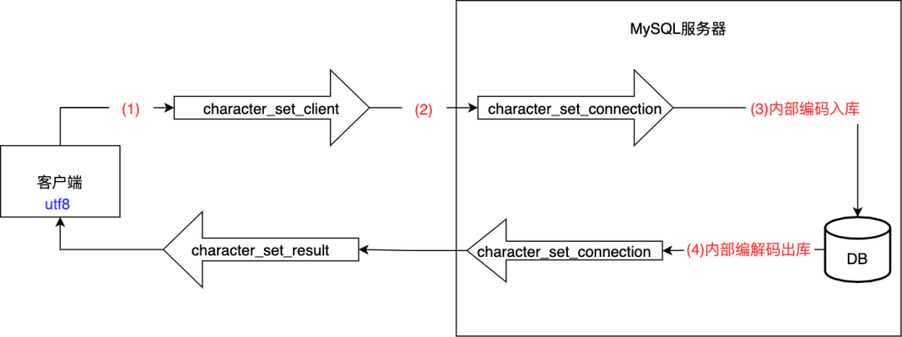

假设客户端用的是 UTF-8 编码，那么发送一条 SQL 语句会发生如下的编解码流程:
假设此时的客户端为 Java 工程，用的是 intellj idea，其默认编码为 UTF-8，那么执行后这条语句会首先被 UTF-8 编码，然后再将其转成 unicode，在 Java 中所有的 String 都是以 unicode 字符存在的，然后再将 unicode 转为用 character_set_client 来编码
character_set_client 编码后是以二进制流的形式传到 MySQL 服务器的，然后再用 character_set_connection 解码，然后 MySQL 引擎（比如 innodDB 引擎）会对这条语句进行语法，词法解析，执行操作
执行后的结果会转为 DB 的编码入库
如果是 SELECT * FROM t 这样的查询操作，那么数据会从 DB 中解码后再用 character_set_connection 编码，再转为用 character_set_result 编码传给客户端，客户端再用 UTF-8 解码得到正常结果
先简单介绍一下上述步骤中涉及到的编码集

character_set_client:  客户端最终发送到服务端 SQL 所采用的编码字符集
character_set_connection: MySQL 服务端收到步骤 1 编码后的二进制流后采用的编码字符集，会将步骤 1 传过来的数据进行解码。一般与 character_set_client 是一样的，有人可能会奇怪，为什么会有这个字符集，直接用 character_set_client 来解码不就行了，它存在的意义是啥呢？其实主要是为了作用上的的分离，character_set_client 主要用来客户端的编码，而 character_set_connection 主要是为了赋予开发人员解析语义的自由，比如考虑 SELECT LENGTH('中') 这样的场景，如果采用 GBK 一个汉字 2 个长度，结果是 2，而如果是 UTF-8 编码，则结果是 3，所以额外设定一个 character_set_connection 编码，让开发人员可以根据需要更自由地定义不同的业务场景
character_set_result: 结果集返回给客户端采用的编码字符集
知道了以上各个字符编码集所代表的释义，现在就可以轻松解释开头的问题了，我们知道对 MySQL 来说，操作无非就是增删改查，所以主要有以下两个转化流程

如果是增删改操作，流程为：客户端--->character_set_client--->character_set_connection---->DB
如果是查操作，客户端--->character_set_client--->character_set_connection---->DB---->character_set_result

如果这两个转化流程对应的每一步都是无损转换，那么结果集就没有问题的
什么是无损转换
假设我们要把用编码 A 表示的字符 X，转化为编码 B 的表示形式，而编码 B 的字符集中并没有 X 这个字符，那么此时我们就称这个转换是有损的，如果在 B 的字符集都能找到 A 中的字符，那么就是无损的，所以最简单的方式就是将每个步骤对应的编码字符集都设置成一样的，比如都设置成 UTF-8，这样就肯定没问题了。

现在回过头来看一下开头的问题，为什么将 DB 数据从公司的测试机导入到个人机器后，如果 SQL 中包含有中文查询如下 jdbc url 的配置会导致原本正常返回的结果集失效呢？
```mysql
jdbc:mysql://10.65.110.9:3306/test?connectTimeout=5000&socketTimeout=20000
```
显然是客户端--->character_set_client--->character_set_connection---->DB---->character_set_result 这个步骤中的结果集发生了有损转换，到底是哪一步呢？

DB 表数据采用的编码都是 UTF-8，如果只要搞清楚 character_set_client，character_set_connection，character_set_result 这三个编码字符集是啥问题就解决了，这个问题的答案得去官网找,来看下官网是怎么说的

The character encoding between client and server is automatically detected upon connection (provided that the Connector/J connection properties characterEncoding and connectionCollation are not set). You specify the encoding on the server using the system variable character_set_server (for more information, see Server Character Set and Collation). The driver automatically uses the encoding specified by the server.
To override the automatically detected encoding on the client side, use the characterEncoding property in the connection URL to the server. Use Java-style names when specifying character encodings. The following table lists MySQL character set names and their corresponding Java-style names:

从中我们可以看到，如果未设置 characterEncoding，那么 character_set_client，character_set_connection，character_set_result 这三的编码字符集与 character_set_server 的设置相同，如果设置了 characterEncoding，那么这三者的值与 characterEncoding 相同，这就是为什么指定了characterEncoding=utf8后 SQL 能正常工作的原因了，

那为什么不指定 characterEncoding=utf8 在公司的测试 MySQL 服务器中可以正常工作呢，显然是设置了 character_set_server，在哪设置？在 MySQL 的配置文件 my.cnf 设置

我们之前提过在 Java 中所有的字符串都以 unicode 形式存在，而 latin 字符集是不包含中文的，那么显然中文的 unicode 在 latin1 中是找不到对应的字符的，这一步就会发生有损编码，这就是为什么在个人的机器上执行带有中文的 SQL 会出异常的根本原因！

所以问题的根因本质上是因为迁移不完整导致的，只迁移了 DB 数据，但没有把 my.cnf 这个配置文件也完整地拷过来！拷过来之后问题就解决了